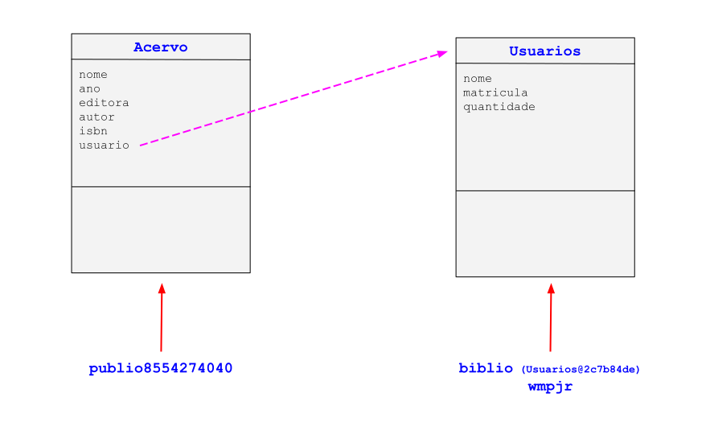

<script src="https://polyfill.io/v3/polyfill.min.js?features=es6"></script>
<script id="MathJax-script" async src="https://cdn.jsdelivr.net/npm/mathjax@3/es5/tex-mml-chtml.js"></script>

<h1>O projeto final</h1>

<p align="justify">Este projeto foi desenvolvido ao longo do meu treinamento.<br><br>
    O primeiro passo deste projeto consiste no entendimento do elemento principal de uma biblioteca que é o livro. Vamos
    entender quais os dados ou atributos de um livro.
</p>
<ol>
    <li>Nome</li>
    <li>Ano</li>
    <li>Editora</li>
    <li>Area</li>
	<li>Autor</li>
	<li>isbn</li>
</ol>

<p align="justify">Quais operações podem ser feitas por exemplo dentro de uma biblioteca:</p>

<ol>
    <li>Retirada</li>
    <li>Devolução</li>
    <li>Descarte</li>
</ol>

<p align="justify">Para iniciar o algoritmo do <b>Biblio</b> vamos criar o arquivo auxiliar, <code>Acervo.java</code>, que guardará as informações da classe <b>Acervo</b>. Para isso criaremos o seguinte código dentro deste arquivo <code>.java</code></p>

```java
class Acervo {
	String nome;
	int ano;
	String editora;
	String area;
	String autor;
	String isbn;
	int quantidade;
}
```

<p align="justify">Para criar um novo livro dentro do acervo da biblioteca vamos empregar a palavra chave <code>new</code>. Portanto escreveremos o seguinte código:</p>

```java
public class AdicionarLivro {
	public static void main(String[] args) {
		Acervo publio8554274040 = new Acervo();
		System.out.println(publio8554274040);
	}
}
```
```
Output
Acervo@76ed5528
```
<blockquote>
    <p align="justify">Perceba que o código Java no seu <i>output</i> referencia um endereço onde está guardada a informação do objetvo instanciado. Além disso é possível observar a variável <code>publio8554274040</code> é do tipo <b>Acervo</b>. Tal fato faz referência a classe criada no arquivo <code>Acervo.java</code>.</p>
</blockquote>

<p align="justify">Agora vamos completar todas as informações do primeiro livro:</p>

```java
public class AdicionarLivro {
	public static void main(String[] args) {
		Acervo publio8554274040 = new Acervo();
		publio8554274040.nome = "Pisos Industriais Com Concreto De Retração Compensada";
		publio8554274040.ano = 2019;
		publio8554274040.editora = "J.J. Carol";
		publio8554274040.area = "Engenharia Civil";
		publio8554274040.autor = "Públio Penna Firme Rodrigues";
		publio8554274040.isbn = "8554274040";
		publio8554274040.quantidade = 10;
		System.out.println("Livro: " + publio8554274040.nome);
		System.out.println("Quantidade: " + publio8554274040.quantidade);
	}
}
```
```
Output
Livro: Pisos Industriais Com Concreto De Retração Compensada
Quantidade: 10
```

<p align="justify">Caso desejemos adicionar <b>+ 30 livros</b> de <b>"Pisos Industriais Com Concreto De Retração Compensada"</b> ao sistema:</p>

```java
public class AdicionarLivro {
	public static void main(String[] args) {
		Acervo publio8554274040 = new Acervo();
		publio8554274040.nome = "Pisos Industriais Com Concreto De Retração Compensada";
		publio8554274040.ano = 2019;
		publio8554274040.editora = "J.J. Carol";
		publio8554274040.area = "Engenharia Civil";
		publio8554274040.autor = "Públio Penna Firme Rodrigues";
		publio8554274040.isbn = "8554274040";
		publio8554274040.quantidade = 10;
		System.out.println("Livro: " + publio8554274040.nome);
		System.out.println("Quantidade: " + publio8554274040.quantidade);
		publio8554274040.quantidade += 30;
		System.out.println("Nova quantidade de livros: " + publio8554274040.quantidade);
	}
}
```
```
Output
Livro: Pisos Industriais Com Concreto De Retração Compensada
Quantidade: 10
Nova quantidade de livros: 40
```
<p align="justify">Para atribuir um valor padrão ao atribuito (estado) é possível fazer isso no arquivo <code>Acervo.java</code>:</p>

```java
class Acervo {
	String nome = "null";
	int ano = 0;
	String editora = "null";
	String area = "null";
	String autor = "null";
	String isbn = "null";
	int quantidade = 0;
}
```

<p align="justify">Utilizando o algoritmo abaixo podemos observar que o valor atribuido na propriedade nome foi <b>null</b> conforme descrito em <code>Acervo.java</code>:</p>

```java
public class AdicionarLivro {
	public static void main(String[] args) {
		// Instanciando o primeio livro
		Acervo publio8554274040 = new Acervo();
		publio8554274040.nome = "Pisos Industriais Com Concreto De Retração Compensada";
		publio8554274040.ano = 2019;
		publio8554274040.editora = "J.J. Carol";
		publio8554274040.area = "Engenharia Civil";
		publio8554274040.autor = "Públio Penna Firme Rodrigues";
		publio8554274040.isbn = "8554274040";
		publio8554274040.quantidade = 10;
		System.out.println("Livro: " + publio8554274040.nome);
		System.out.println("Quantidade: " + publio8554274040.quantidade);
		publio8554274040.quantidade += 30;
		System.out.println("Nova quantidade de livros: " + publio8554274040.quantidade);
		System.out.println();
		
		// Instanciando o segundo livro
		Acervo nilo8575227181 = new Acervo();
		System.out.println("Novo livro");
		System.out.println("Livro: " + nilo8575227181.nome);
	}
}
```
```
Livro: Pisos Industriais Com Concreto De Retração Compensada
Quantidade: 10
Nova quantidade de livros: 40

Novo livro
Livro: null
```

<p align="justify">Para entender o conceito de método vamos melhorar a forma como adicionamos livros ao nosso acervo. Para isso vamos criar o método de adicionar livros no acervo. Logo os métodos serão adicionados dentro do arquivo <code>Acervo.java</code>. Veja:</p>

```java
class Acervo {
	String nome = "null";
	int ano = 0;
	String editora = "null";
	String area = "null";
	String autor = "null";
	String isbn = "null";
	int quantidade = 0;

	void deposita(int quantidade_add) {
		this.quantidade += quantidade_add;
	}
}

public class AdicionarLivro {
	public static void main(String[] args) {
		// Instanciando o primeio livro
		Acervo publio8554274040 = new Acervo();
		publio8554274040.nome = "Pisos Industriais Com Concreto De Retração Compensada";
		publio8554274040.ano = 2019;
		publio8554274040.editora = "J.J. Carol";
		publio8554274040.area = "Engenharia Civil";
		publio8554274040.autor = "Públio Penna Firme Rodrigues";
		publio8554274040.isbn = "8554274040";
		publio8554274040.quantidade = 10;
		System.out.println("Livro: " + publio8554274040.nome);
		System.out.println("Quantidade: " + publio8554274040.quantidade);

		
		// Nova quantidade de livros usando método
		publio8554274040.deposita(30);
		System.out.println("Nova quantidade de livros: " + publio8554274040.quantidade);
		System.out.println();
	}
}
```
```
Output:
Livro: Pisos Industriais Com Concreto De Retração Compensada
Quantidade: 10
Nova quantidade de livros: 40
```

<blockquote>
<p align = "justify">No caso a palavra-chave <code>this</code> fará a referência ao atributo <b>quantidade</b> que é onde deseja-se fazer a alteração via métodos.</p>
</blockquote>

<p align="justify">Agora vamos criar um método que efetua um retorno. No caso um método para efetuar a retirada de um livro ou empréstimo.</p>

```java
class Acervo {
	String nome = "null";
	int ano = 0;
	String editora = "null";
	String area = "null";
	String autor = "null";
	String isbn = "null";
	int quantidade = 0;

	void deposita(int quantidade_add) {
		this.quantidade += quantidade_add;
	}

	boolean emprestimo(int numero_emprestimo) {
		if (this.quantidade >= numero_emprestimo) {
			this.quantidade = this.quantidade - numero_emprestimo;
			return true;
		} else {
			return false;
		}
	}
}

public class AdicionarLivro {
	public static void main(String[] args) {
		// Instanciando o primeio livro
		Acervo publio8554274040 = new Acervo();
		publio8554274040.nome = "Pisos Industriais Com Concreto De Retração Compensada";
		publio8554274040.ano = 2019;
		publio8554274040.editora = "J.J. Carol";
		publio8554274040.area = "Engenharia Civil";
		publio8554274040.autor = "Públio Penna Firme Rodrigues";
		publio8554274040.isbn = "8554274040";
		publio8554274040.quantidade = 10;
		System.out.println("Livro: " + publio8554274040.nome);
		System.out.println("Quantidade: " + publio8554274040.quantidade);

		
		// Nova quantidade de livros usando método
		publio8554274040.deposita(30);
		System.out.println("Nova quantidade de livros: " + publio8554274040.quantidade);
		System.out.println();

		// Empréstimo de livro
		boolean o_emprestimo = publio8554274040.emprestimo(50);
		System.out.println("O empréstimo foi possível?: " + o_emprestimo);
	}
}
```
```
Output:
Livro: Pisos Industriais Com Concreto De Retração Compensada
Quantidade: 10
Nova quantidade de livros: 40

O empréstimo foi possível?: false
```

<p align="justify">Para testar a comunicação entre dois objetos vamos testar a transferência de um livro da biblioteca central para um usuário tipo aluno. Para isso vamos criar uma nova classe chamada <code>Usuarios.java</code>. No caso está classe ficaria no seguinte formato:</p>

```java
class Usuarios {
    String nome;
    String matricula;
    int quantidade;
    
    
    public boolean transfere(int numLivros, Usuarios destino) {
        if (this.quantidade > 0) {
            this.quantidade -= numLivros;
            destino.quantidade += numLivros;
            System.out.println("Foi possível transferir o livro!!!!");
            return true; 
        } else {
            System.out.println("Não foi possível transferir o livro!!!!");
            return false;
        }
    }
}
```

<blockquote>
<p align = "justify">Veja que já foi criado o método de transferência do livro que sempre tira uma unidade de um objeto e passa para dentro do objeto <code>destino</conta>.</p>
</blockquote>

<p align="justify">Fazendo o teste da transferencia em um novo arquivo temos o seguinte algoritmo:</p>

```java
public class Biblioteca {
    public static void main(String[] args) {
        int numUsuarios = 0;
        // Instanciando um novo usuário: Biblioteca
        Usuarios biblio = new Usuarios();
        biblio.nome = "Biblioteca central";
        biblio.matricula = "0000";
        biblio.quantidade = 10000;
        numUsuarios += 1;
        
        // Instanciando um novo usuário: Aluno 1
        Usuarios wmpjr = new Usuarios();
        wmpjr.nome = "Wanderlei Malaquias Pereira Junior";
        wmpjr.matricula = "0001";
        wmpjr.quantidade = 0;
        numUsuarios += 1;
        
        // Impressões 
        System.out.println("Número de usuários do sistema: " + numUsuarios);
        System.out.println("Usuário 0: " + biblio.nome);
        System.out.println("Quantidade de livros: " + biblio.quantidade);
        System.out.println("Usuário 1: " + wmpjr.nome);
        System.out.println("Quantidade de livros: " + wmpjr.quantidade);
        
        // Transferindo um livro para um usuário
        boolean saida = biblio.transfere(1, wmpjr);
        
        // Impressões 
        System.out.println("Verificando a trasferência de livro: ");
        System.out.println("Usuário 0: " + biblio.quantidade);
        System.out.println("Usuário 1: " + wmpjr.quantidade);
    }
}
```
```
Output:
Número de usuários do sistema: 2
Usuário 0: Biblioteca central
Quantidade de livros: 10000
Usuário 1: Wanderlei Malaquias Pereira Junior
Quantidade de livros: 0
Foi possível transferir o livro
Verificando a trasferência de livro: 
Usuário 0: 9999
Usuário 1: 1
```

<p align="justify">Perceba que a partir desse momento teremos duas classes sendo uma usuário e outra acervo e todo livro do acervo aponta para um cliente. Portanto essa técnica é chamada de composição. Veja como fica o algoritmo:</p>

```java
class Acervo {
	String nome = "null";
	int ano = 0;
	String editora = "null";
	String area = "null";
	String autor = "null";
	String isbn = "null";
	Usuarios usuario; 
}

class Usuarios {
    String nome;
    String matricula;
    int quantidade;
    
    
    public boolean transfere(int numLivros, Usuarios destino) {
        if (this.quantidade > 0) {
            this.quantidade -= numLivros;
            destino.quantidade += numLivros;
            System.out.println("Foi possível transferir o livro!!!!");
            return true; 
        } else {
            System.out.println("Não foi possível transferir o livro!!!!");
            return false;
        }
    }
}

public class Biblioteca {
    public static void main(String[] args) {
        
        int numUsuarios = 0;
        int numLivros = 0;
        
        // Instanciando um novo usuário: Biblioteca
        Usuarios biblio = new Usuarios();
        biblio.nome = "Biblioteca central";
        biblio.matricula = "0000";
        biblio.quantidade = 0;
        
        // Instanciando um novo usuário: Aluno 1
        Usuarios wmpjr = new Usuarios();
        wmpjr.nome = "Wanderlei Malaquias Pereira Junior";
        wmpjr.matricula = "0001";
        wmpjr.quantidade = 0;
        numUsuarios += 1;
        
        // Instanciando o primeio livro
        Acervo publio8554274040 = new Acervo();
        publio8554274040.nome = "Pisos Industriais Com Concreto De Retração Compensada";
        publio8554274040.ano = 2019;
        publio8554274040.editora = "J.J. Carol";
        publio8554274040.area = "Engenharia Civil";
        publio8554274040.autor = "Públio Penna Firme Rodrigues";
        publio8554274040.isbn = "8554274040";
        publio8554274040.usuario = biblio; // Composição aqui !!!!
        biblio.quantidade += 1;
        numLivros += 1;
        
        // Impressões
        System.out.println(":::Cadastro de livro novo:::");
        System.out.println("Local: " + publio8554274040.usuario.nome);
        System.out.println("Ref. usuário: " + publio8554274040.usuario);
        System.out.println("Ref. local: " + biblio);
    }
}
```
```
Output:
:::Cadastro de livro novo:::
Local: Biblioteca central
Ref. usuário: Usuarios@2c7b84de
Ref. local: Usuarios@2c7b84de
```

<blockquote>
<p align = "justify">Perceba que a referência do usuário e do local onde o livro está é a mesma. Tal situação pode ser vista visualmente na Figura 1.</p>
</blockquote>

<center></center>
<p align = "center"><b>Figura 1</b>. Representação da referência do usuário que está com o livro.</p>
